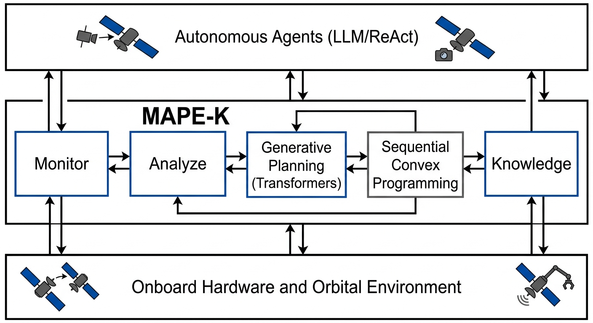

# Arquitecturas de Inteligencia Artificial Generativa y Agentes Autónomos para Operaciones de Servicio en Órbita: Un Marco de Referencia Técnico

---

Las operaciones de servicio en órbita (OSAM) demandan niveles crecientes de autonomía debido a la proliferación de constelaciones y la latencia de comunicaciones. Este trabajo presenta un marco de referencia técnico que integra arquitecturas de IA generativa (transformers y LLMs) con sistemas multi-agente autónomos para tareas de rendezvous, inspección, reparación y ensamblaje en órbita. Se proponen componentes modulares basados en MAPE-K extendido con agentes ReAct y reinforcement learning (RL/MARL), junto con garantías de seguridad mediante optimización convexa secuencial warm-started por modelos generativos. Se discuten implementaciones onboard en hardware rad-hard (NVIDIA Jetson Orin y equivalentes), evaluación en simuladores de alta fidelidad (OrbitZoo, KSPDG) y métricas cuantitativas de eficiencia de combustible, tiempo de convergencia y robustez ante perturbaciones. Los resultados preliminares indican mejoras significativas en autonomía y eficiencia frente a enfoques tradicionales, estableciendo una base reproducible para futuras misiones OSAM.

---

**Palabras clave:** _Servicio en Órbita (OSAM), IA Generativa, Agentes Autónomos, Grandes Modelos de Lenguaje (LLM), Aprendizaje por Refuerzo Multi-Agente (MARL), Rendezvous y Proximidad (RPO), Sistemas Autónomos, Arquitectura MAPE-K._
